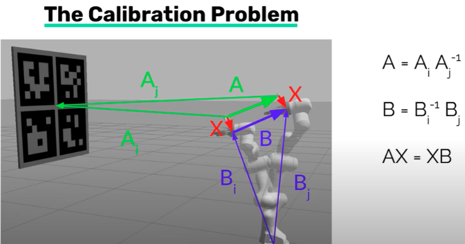

## Overview
Takes set of [RGB image, End-effector pose] from realsense D435 camera mounted on Franka Robot Arm, to solve the Ax = xB calibration problem using the ChAurco board where x = extrinsic calibration.

## Install
- python3 and compatiable opencv version to run ChAruco functions. Best found by running it and resolving the missing libaries.
```
$ pip install opencv-contrib-python

```
- VISP ros node package to solve Ax=Bx given pair of [cam,ee pose]. Refer to http://wiki.ros.org/visp_hand2eye_calibration
```
$ sudo-apt get install ros-$ROS_DISTRO-visp-hand2eye-calibration

```
- realsense SDK package. Refer to https://github.com/IntelRealSense/realsense-ros. If installed correctly, should be able to roslaunch realsense2 file
```
$ roslaunch realsense2_camera rs_aligned_depth.launch

```

## Set up
- Place a ChAruco board in FOV of Franka Robot arm with realsense. ChAruco board can be generated from https://calib.io/pages/camera-calibration-pattern-generator.
- Franka robot is turned on and the Frankapy ROS API interface is up and running by calling below command. Franka joint /tf topics should be published and visible on RViz. 
 ```
$ cd Prog/frankapy
$ bash bash_scripts/start_control_pc.sh -u student -i iam-[insert robot name here]

```

## Running
- Modify the main.py file to adjust the path to where you want the generated cam_transform.csv and ee_transform.csv files.  
- Modify the main.py file to adjust the intrinsic camera calibration info. You can do this by rosecho calling the topic /camera/color/camera_info.
- Modify the ChAruco.py file init function to adjust the CharucoBoard_create() parameters with the ChAruco board dimensions you printed.  

```
$ python main.py

```
- Given the generated two .csv files, modify publisher.py file if needed to see the path to the two .csv files are correct and can be loaded.
- Run the VISP server that will print out camera extrinsic info upon a rosservice call to publish the data. The sequence is as follows in separate terminals:

```
$ rosrun visp_hand2eye_calibration visp_hand2eye_calibration_calibrator
$ python publisher.py
$ rosservice call compute_effector_camera

```
The calibrator node will subscribe to the published [cam,ee pose pairs], then upon a service call, print out the extrinsic calibration matrix.
